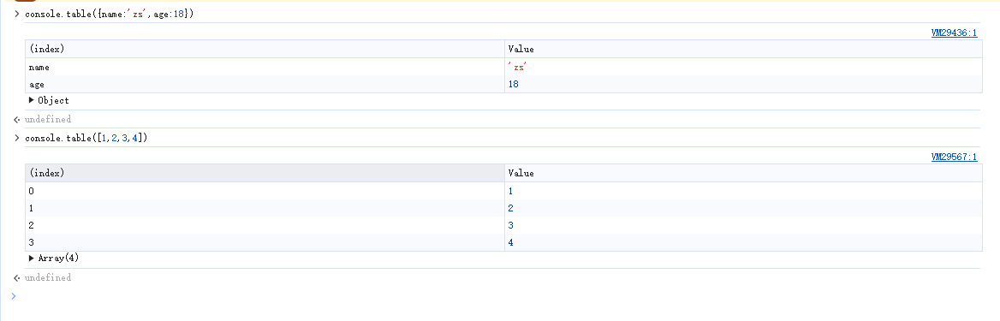
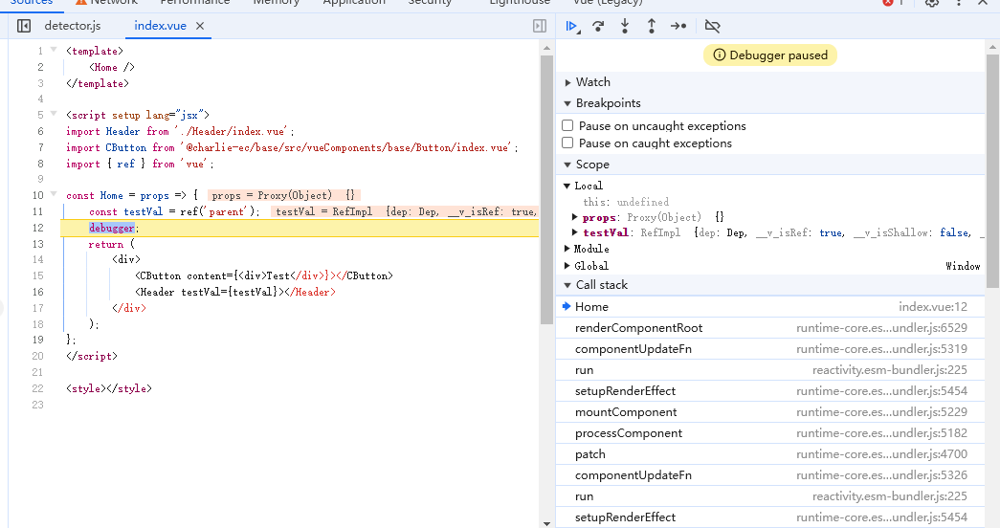

# 前端最全 debugger 技巧

## 前言

Bug 调试是每个开发人员都应该具备的能力，那么如何才能较为高效的进行前端的 bug 定位与调试呢?我们日常中使用的浏览器开发者工具，你真的了解它吗？

本文将以浏览器开发者工具核心功能，三方框架配套插件等工具，对日常开发调试，线上 bug 调试，白屏、卡顿等问题进行深入讲解，同时也将对移动端及 Node 端调试入门进行一些基础的讲解

## 浏览器开发者工具

浏览器开发者工具对于前端来说是使用最多的 Web 端 Debug 工具，其中开发者最为熟悉的为谷歌浏览器调试工具，除了谷歌外，别的浏览器或者一些 Webview 环境也提供了对应的开发者工具，功能大致相同，在此以谷歌浏览器（V131）作为 Demo 讲解

谷歌浏览器开发者工具到目前为止已经提供了 30 多种功能给到开发者进行页面调试，可以到 **More tools** 中查看所有功能，本文主要围绕日常开发中最常用的功能进行讲解，主要包含 **Elements**,**Console**,**Sources**,**Network**,**Performance**,**Application** 几个模块

### Elements（元素）

Elements 主要用于对 Dom 树及 Css 样式表的页面调试

#### 基本功能

- 查看网页结构

  打开 Elements 标签后，你可以看到当前网页的 HTML 结构（DOM）。
  使用鼠标悬浮或点击 DOM 元素，网页上相应的部分会高亮显示。

- 查看和修改元素属性

  双击某个 HTML 标签，你可以编辑它的属性（如 id、class 等）。
  右键某个标签 → Edit as HTML，可以编辑整个标签的内容。

- 实时修改样式

  在右侧的 Styles 面板中，可以看到选中元素的 CSS 样式。
  点击样式规则旁边的值，可以直接修改，结果会实时反映在网页上。
  你可以添加新的样式规则，临时调试和测试布局效果。

- 检查元素的状态

  右键某个元素 → Force state，可以模拟元素的伪类状态，如 :hover、:focus、:active 等，方便调试动态样式。

#### 实用技巧

- 快速复制选择器

  当你使用三方组件，并且需要做样式覆盖时，可右键对应元素选中 copy=>copy selector 快速获取对应选择器

- 在 dom 中快速定位元素

  当 dom-tree 上元素特别多的时候，想快速定位元素可以在 element 中键入 ctrl+f 并且输入关键字，如 class、id、元素上的属性等，即可快速定位到对应元素

- 快速在 Styles 中定位生效样式

  当某个元素的 css 样式特别多时，在 Styles 中较难看出某个属性到底最终生效的是哪个选择器中的权重，我们可以通过 Styles 旁边的 Computed 页签来快速查看各个属性生效的值，hover 到对应数值上，点击左侧小按钮即可快速定位到 Styles 中该属性选择器生效的地方

  
  

### Console(控制台)

Console 标签提供了非常丰富的功能，除了简单的日志输出，还能帮助你测量性能、调试异步代码、跟踪函数调用等。掌握这些技巧，可以让你在开发过程中更加高效地调试和优化代码。

#### 常用输出方法

- console.log：开发时输出普通的日志信息，一般会在打包时去掉
- console.info：用于一些关键节点数据的控制台打印，用于线上问题排查
- console.error：一般用于异常捕获后在 catch 中用来打印报错内容
- console.warn：一般用于某些 sdk 的日志打印，尤其是一些降级逻辑的开启
- console.table：对数组和对象的输出，输出内容以表格展示，方便查看

  

- console.time：常用于函数计时的开始，用于测试复杂函数的执行性能
- console.timeEnd：函数计时的结束

  

- console.count: 常用于函数执行次数统计，每执行一次返回值则在当前作用域下+1

  

- console.countReset：搭配 count 使用，可以重置当前作用域下的 count 次数

- console.trace：打印当前输出被调用的完整调用栈，类似于 debugger 中的 call-tree

  

- console.group：和 console.groupEnd()搭配使用给 console 分组

  

- console.clear：清除所有 console 的记录

#### Console 中运行代码

在我们的 Console 控制台除了能够根据各种函数打印日志外，也能直接运行 JS 代码，在 debugger 下，作用域为当前 debugger 执行到的函数上下文作用域，非 debugger 中则为全局作用域

### Sources(源代码/来源)

Sources 标签主要用于调试和分析 JavaScript 代码，它提供了强大的功能，帮助开发人员查看和调试源码，其中 断点调试功能更是任何前端程序员都必须熟练掌握的技巧

#### 常见断点技巧

我们在开发过程中，常常需要使用到 debugger 功能，基于开发者工具，我们常用的 Debugger 功能包括：**代码断点**，**SourcePage 断点**, **网络断点**，**Dom 断点**,**事件断点**等

在通过以上几个技巧进入到断点后，我们可以通过开发者工具的来进行代码的步进，变量的监听，call-stack 的回溯等等手段来定位及修复疑难 bug

下面我们逐一讲解在不同场景下，我们该如何进入到断点调试中

- 代码断点

  代码断点是指，在我们的代码中，通过“debugger”关键字来进入断点，当开发者工具处于打开时，代码执行到 debugger 关键字时，则会自动进入到断点中
  

- SourcePage 断点

  当我们的静态资源打包部署到服务器后，用户输入对应域名后，浏览器会请求到对应资源进行解析用于页面的渲染和逻辑的执行，而所有静态资源都会在 Source 的 page 中显示，我们可以通过在对应 page 下找到你的代码，然后点击对应行，即可进行断点，该方法还可以搭配条件断点使用，在后续会详细讲解
  

- 网络断点

  我们有时可能会遇到某些接口请求不知道是在哪里调用的，代码里又有很多地方都用到了该接口，这个时候，我们就可以通过网络断点结合 call-tree 来找到接口调用处
  
  

- Dom 断点

  在 JQ 时代，前端研发都是通过操作 Dom 来改变视图，那个时候每个 dom 的新增，删除，修改都是人为控制的， 现在为了提升开发效率，各大前端框架均是以数据驱动视图作为核心，修改数据后，由 VM 进行视图的更新，当数据流较为复杂时，可能出现 Dom 的修改操作无很难进行溯源，而元素断点功能就可以轻松实现 Dom 操作溯源

- subtree modifications: 该节点的子节点变化时进入断点
- attribute modifications: 该节点的属性发生变化时进入断点
- node removal：该节点被移除时进入断点

进入断点后，我们根据对应的 call-tree 即可找到使 dom 变化的源头

### Network(网络)

### Performance(性能)

### Application(应用)

## 三方框架插件

## 线上 bug

## 白屏问题

## 卡顿问题

## 移动端调试

## Node 调试
