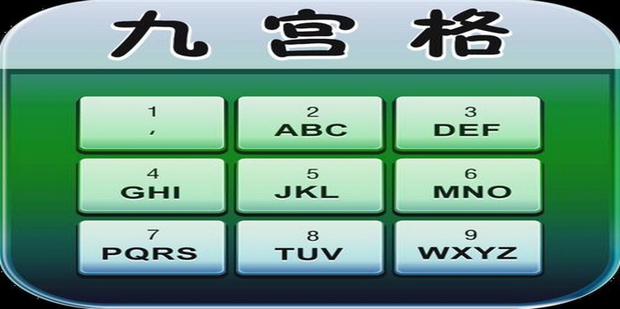

# 做过的算法题合集

## 1. 版本号排序

### 题目描述

给定一个版本号数组，按照版本号的大小进行排序。

### 示例

```javascript
const arr = ['0.3.2', '3.0.1', '2.0.3', '1.2.0', '2.1.2', '2.1.0', '0.2.1'];
console.log(sortArrByVersionId(arr));
// 输出: ['0.2.1', '0.3.2', '1.2.0', '2.0.3', '2.1.0', '2.1.2', '3.0.1']
```
### 答案

```javascript
function sortArrByVersionId(arr) {
	if (!Array.isArray(arr)|| arr?.length<=1) return arr;

	return arr.sort((a, b) => {
		const aArr = a.split('.').map(Number);
		const bArr = b.split('.').map(Number);
		for (let i = 0; i < 3; i++) {
			if (aArr[i] !== bArr[i]) {
				return aArr[i] - bArr[i];
			}
		}
		return 0;
	});
   
}
```

## 2.穷举拼音九宫格

### 题目描述


给定一个字符串（2-9），每个数组上面有对应字母（2->abc,3->def...），返回所有可能的拼音组合。

### 示例

```javascript
const str = '23';
console.log(logLetterByNumber(str));
// 输出: ['ad', 'ae', 'af', 'bd', 'be', 'bf', 'cd', 'ce', 'cf']
```
### 答案

```javascript
function logLetterByNumber(str){
    if(typeof str !=='string' || str?.length<1) return [];

    const letterMap = {
        2:['a','b','c'],
        3:['d','e','f'],
        4:['g','h','i'],
        5:['j','k','l'],
        6:['m','n','o'],
        7:['p','q','r','s'],
        8:['t','u','v'],
        9:['w','x','y','z']
    };

    const result = []

    const recurFunc = (cur,letters)=>{
        if(letters.length===0){
            result.push(cur);
            return 
        }
        const digits = letterMap[letters[0]];
        for (const letter of digits) {
            recurFunc(cur + letter, letters.slice(1));
        }
    }

    recurFunc('',str)

    return result
} 
```
## 3. 数组间取交集

### 题目描述

入参：二维数组，[[2,3,4],[3,4],[43,2,3,4]...]  出参:各个数组间的交集部分，[3,4];

### 示例

```javascript
const arr = [[2,3,4],[3,4,5],[4,5,6]];
console.log(getIntersection(arr));
// 输出: [4]
```
### 答案

```javascript
function getIntersection(arr){
    if(!Array.isArray(arr)||arr?.length<1) return[];

    const checkExist = item=>{
        return arr.slice(1).every(arrItem=>{
            return arrItem.includes(item)
        })
    }
    const result = []
    arr[0].forEach(item=>{
        if(checkExist(item)){
            result.push(item)
        }
        
    })

    return result
}
```


