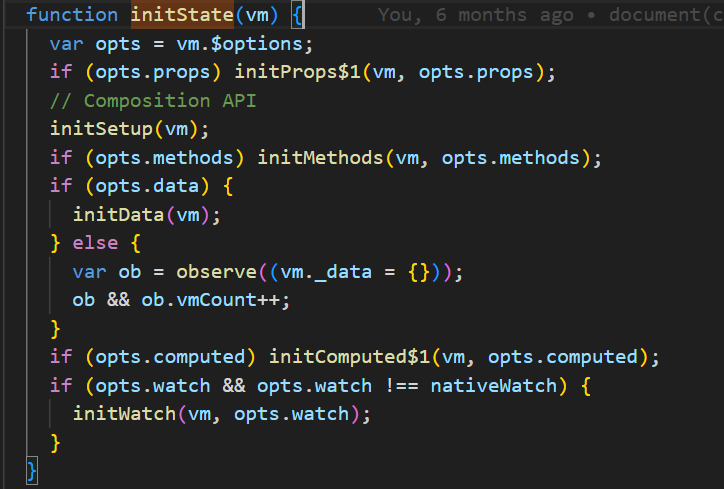

# Vue2源码分析之响应式原理

## 前言

相信使用过Vue的前端开发者对于Vue数据驱动的思想已经非常熟悉，但是究竟Vue是如何做到修改数据后，视图自动更新的呢？本文将结合源码探究从数据变化到视图更新的过程中发生了哪些事情

## 一切的起点- new Vue

从main.js中的new Vue，到$mount将视图及数据绑定，并且挂载真实Dom之间，Vue内部发生了些什么事呢，我们结合源码一起看看

上述代码是Vue的构造器函数，我们能看到new Vue时，其实只是调用了_init函数，并且将我们定义的options传入，options即为我们业务代码里export default 暴露的对象，里面包含了data,props,computed,watch,methods等等

我们可以看出在_init中，vue完成了大部分的初始化工作，包括生命周期，事件，render函数，各个状态值等等，为了减少阅读成本，我们先只深入**initState**中，看看Vue是做到数据驱动视图的

在initState中，主要对props,methods,data,computed,watch分别进行了初始化，初始化的过程就是数据实现响应式的过程

 **initData**

从上述代码里我们可以看到，在observe（data）调用前，所有的代码都是一些边界处理及错误的前置判断

首先会根据你传入的data是函数还是对象，来决定data的获取方式，拿到data后，会去遍历data里的key，分别和methods及props中的key进行对比，看是否同名，我们能够直观的看出，具体优先级是props> data > methods的 

在处理完各种判断后，调用了observe函数并且将data进行了传入

在observe中，也是先做了一些前置判断，如已经observe过的函数会有一个__ob__属性，这个时候就不会再次调observe减少性能开销，接着if判断中，有许多判断条件做边界处理，我们逐个讲解下

1. shouldObserve: 固定变量，写死的true，应该是vue用于代码调试时使用的
2. ssrMockReactivity || !isServerRendering : 当vue是服务端渲染的情况，这里暂不探究
3. isArray || isPlainObject : 只有数组和对象才会进行observe处理，这里非常重要，后续observe函数会被递归调用，用于响应式的深度处理，如data:{obj1:{obj2:{name:'zs'} } },obj2也具备响应式，该判断条件作为递归的结束条件
4. Object,isExtensible, !value.__v_skip , !isRef(value), !value instanceof VNode: 这些判断条件分别是判断对象是否能够扩展，是否需要跳过observe,是否是compositionApi的ref函数处理过，是否本身就是VNode(虚拟节点)，我们暂时都默认为true即可

判断条件都符合后，这里会new Observer对象 ，并且传入了value,这里的value，我们可以看出，其实就是我们写的options中的data

Observer的构造器函数中，我们可以看到主要是做了以下几件事
1. 将传入的对象放到实例的value上
2. 确定shallow的值，用于判断本次监听是深度还是非深度，非深度仅监听对象地址值变化，深度的话会同时监听对象里的属性变化
3. new一个Dep对象，并且放到该observer实例的dep属性上
4. 将当前实例同时添加到传入的value对象上的__ob__属性上，避免后续同个对象多次执行observer
5. 如果Value是数组的话调用observeArray函数进行监听
6. 如果Value是对象的话，遍历其所有属性，每次都会调用defineReactive函数去进行响应式监听

我们先来看如果value是数组的情况，其实这里会对数组的每一项遍历，本质上是再次调用observe函数，形成递归，如果当前遍历项是数组，则会在observe调用new Observer时继续执行observeArray, 如果是对象则会在new observer时调用defineReactive，如果是基本数据类型，则在observe函数中不符合if条件，停止递归

defineReactive是响应式体系中最核心的一个函数，我们常说的defineProperty监听对象各个属性的set和get就是在这里完成的

结合前文，我们知道当前调用defineReactive是在new Observer时，判断当前的value是对象时，会遍历该对象的key，并且每次将对象及当前遍历的key传入defineReactive,所以我们能够知道，defineReactive的执行单位是对象上的每个key

整个defineReactive中最核心的逻辑如下：

1. 实例化一个Dep对象，并且通过闭包的方式与在传入的obj及key形成访问关联,这个dep实例的作用是用于存放及派发watcher，在此暂时可以简单将watcher理解为一个个回调函数，在监听的数据变化后，会去调用这些回调函数来更新视图或者处理其它副作用，后面会详细介绍各类watcher
2. 通过Object.defineProperty去对传入的对象进行数据劫持，在get的时候（也就是访问对象的当前key时）会调取步骤1中创建的dep实例的depend方法，收集watcher，在set的时候（也就是修改当前对象当前key的值时）会去调用dep实例的notify函数，去派发watcher

注意：在此基础较弱的同学需要仔细思考下，实例化出来的dep是如何和对象的key进行关联，以及dep是如何持久化存在的

到目前为止，我们已经初步了解了从new Vue到data的各个属性具备响应式的全过程，我们先对这个过程的调用栈进行小结

new Vue(options) => _init(options)=> initState(vm)=>initData(vm)=> observe(data)=> new Observer(data) => defineReactive(data,key)=>get=>dep.depend=>set=>dep.notify

在该过程中，options中的data的各个属性值均通过Object.defineProperty进行数据劫持，在get时，会去调取dep实例的depend方法，收集watcher，在set时，会去调用dep实例的notify方法，调用前面get时收集到的watcher, 而这些watcher本质是就是函数，其中就包括了Vue._update这个更新视图的函数，执行时，Vue就会通过操作dom的方式让真实Dom更新，从而达到页面视图重新渲染的目的

## Vue的核心类

在第一部分 new Vue的章节中，我们对从数据变化，到视图更新的流程有了大致的了解，但是一些细节上的东西还是比较模糊的，比如 dep实例的depend 和 notify函数究竟是怎么收集和派发watcher的,watcher又是什么，在哪生成，有什么作用等等，接下来我们会讲解vue2响应式体系中除了上文已经提到的Observer外，另外2个核心的类,Dep及Watcher

### Dep

通过Dep的构造器函数，我们能够看出，dep实例的具有3个属性

1. _pending：用于标记当前 dep实例是否有待清理的watcher
2. subs：存放当前dep实例收集的watcher
3. id：用于标识当前dep实例的唯一性

那么Dep实例又有哪些方法呢？

1. addSub

